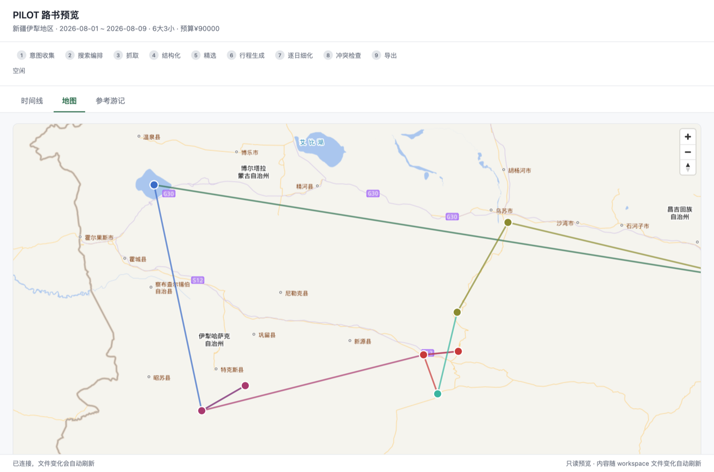
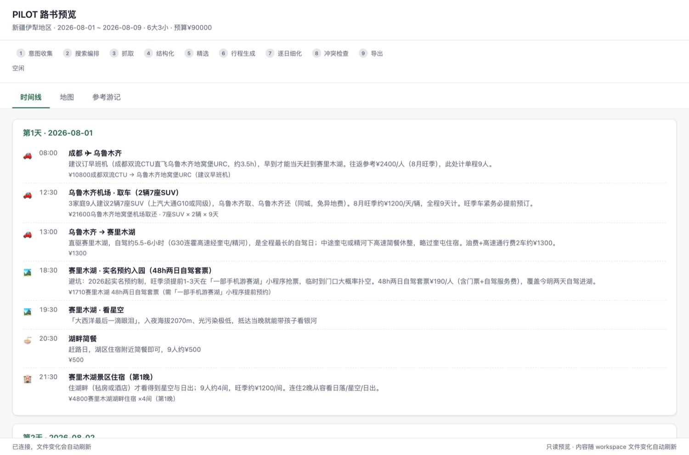
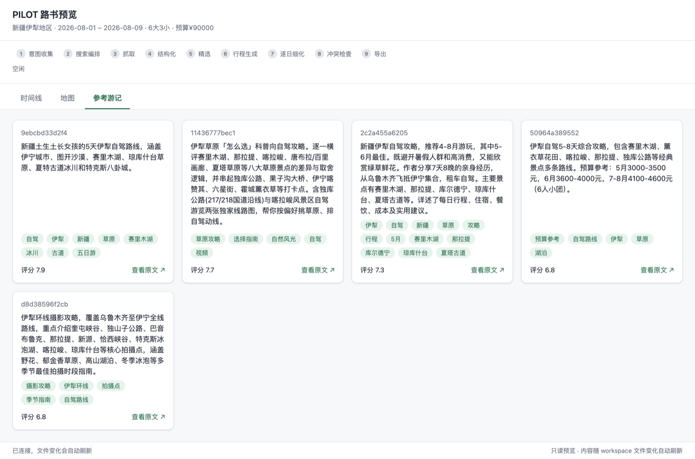
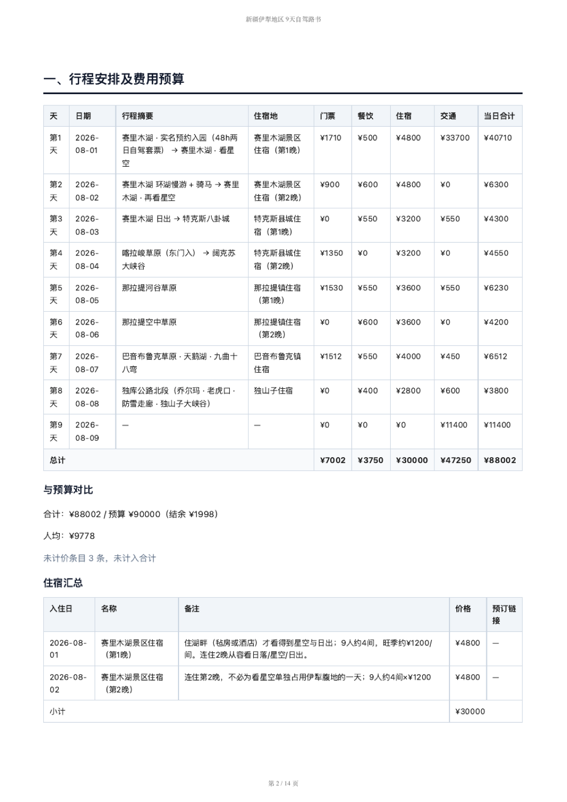
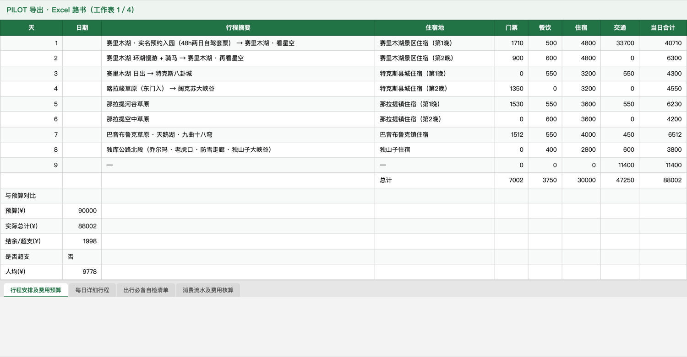
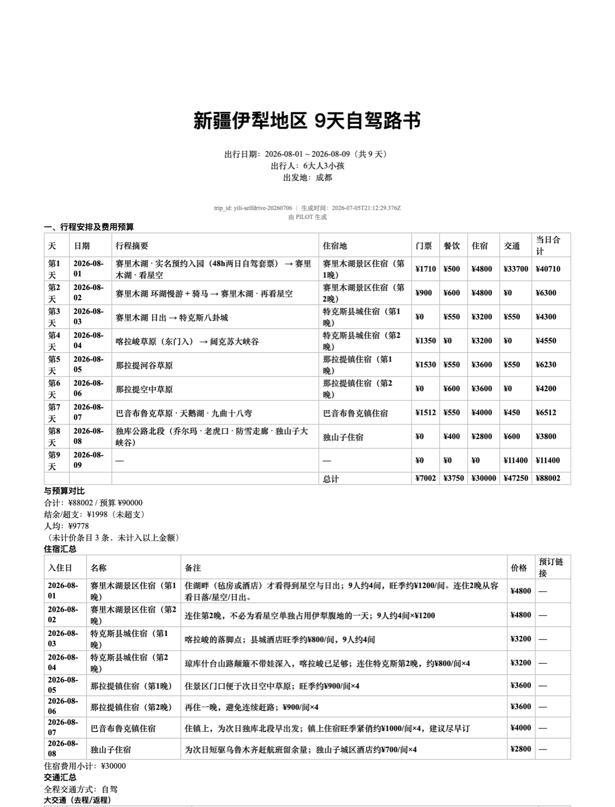

# 快速上手教程：从安装到第一份路书

**中文** | [English](https://twisker.github.io/pilot-skill/en/tutorial-quickstart.html)

本教程完整走一遍 PILOT 的主链路：**安装 → 第一个行程 → 对话编辑 → 导出三格式路书**。全程约 30-60 分钟（大部分时间是搜索与抓取，你只需要偶尔回答问题和做选择）。

## 0. 前置条件

- 已安装 [Claude Code](https://claude.com/claude-code) 并能正常使用
- Node.js >= 20（`node -v` 确认）
- **macOS / Windows / Linux 均可**（Windows 原生支持，不需要 WSL）

## 1. 安装

**macOS / Linux：**

```bash
git clone https://github.com/twisker/pilot-skill.git ~/.pilot/app
cd ~/.pilot/app && ./install.sh
```

**Windows（PowerShell / cmd）：**

```powershell
git clone https://github.com/twisker/pilot-skill.git $env:USERPROFILE\.pilot\app
cd $env:USERPROFILE\.pilot\app
node install.mjs
```

预期输出（节选）：

```
[pilot-install] 检查依赖 ...
[pilot-install] node v24.14.1 / npm 11.16.0 / git OK
[pilot-install] 本仓已位于安装位 /Users/you/.pilot/app，原地使用（git pull 即可更新）
[pilot-install] 安装 tools 依赖（npm install）...
[pilot-install] 下载 playwright chromium（抓取兜底 / PDF 导出用，首次约 150MB）...
[pilot-install] 注册 Skill：symlink /Users/you/.claude/skills/pilot → /Users/you/.pilot/app/skill
[pilot-install] 安装完成。后续步骤：
  1) 配置地图 key ...
  2) 导出站点 cookie ...
  3) 开始使用：新开一个 Claude Code 会话，输入 /pilot ...
```

**推荐顺手做两件事**（都可跳过，之后随时补）：

```bash
# 地图底图 key（免费）：https://console.tianditu.gov.cn/ 申请「浏览器端」应用
echo 'TIANDITU_KEY=你的key' >> ~/.pilot/app/.env

# 站点 cookie（大幅提升游记抓取成功率，全程本地保存）
npx tsx ~/.pilot/app/tools/cookies.ts setup
```

## 2. 第一个行程：意图收集

新开一个 Claude Code 会话（任意目录），输入：

```
/pilot 十一云南自驾 6 天，两大人带娃
```

PILOT 会先补齐它还不知道的信息（一轮最多问 3 个问题）：

```
PILOT：好的，云南自驾带娃！确认三件事：
      1. 具体几号出发、几号回？
      2. 从哪个城市出发？
      3. 总预算大概多少？（不方便说就跳过）
```

回答后，PILOT 创建行程并复述画像让你确认：

```
PILOT：确认一下：10/1-10/6 共 6 天，昆明出发，2 大人 + 1 娃，
      自驾，预算 ¥15000，偏好轻松节奏。没问题我就开始搜游记了。
```

同时它会启动**地图伴侣**（本地网页 http://localhost:4870 ，三视图：时间线 / 地图 / 参考游记卡片墙），行程每次变化浏览器自动刷新。地图会把全程景点按行程顺序连成一条连续路线（天内 + 跨天、按天配色，直线示意路线走向）。



时间线视图逐日逐项列出安排、花费与备注；参考游记卡片墙展示精选的 5 条蓝本候选与品味评分：




## 3. 搜索与精选（PILOT 自动完成，你看汇报）

PILOT 会生成多源搜索计划，逐源搜索 → 挑选候选 → 抓取正文 → 每条游记派一个子代理结构化 → 打分精选。结束时给出**如实的覆盖率汇报**：

```
本轮搜索覆盖率：
- 携程攻略：搜到 10 条 → 选 6 → 抓取成功 5
- 知乎：搜到 15 条 → 选 8 → 成功 6
- 马蜂窝：搜到 18 条 → 选 12 → 成功 2（其余被滑块验证码拦截）
- 小红书：无法抓取（需要登录 cookie）
- B站：3 条视频待第二轮处理
可用于结构化的游记：13 条。
```

> 部分源被拦是**常态**，不是故障。素材太少时 PILOT 会明确说「本次参考素材偏少，行程质量会打折扣」，并给你三个选项：继续 / 导出 cookie 后重试 / 换词重搜。见 [cookie 指南](https://twisker.github.io/pilot-skill/zh/guide-cookies.html)。

然后展示精选 5 条参考游记（标题 + 简介 + 标签 + 评分 + 天数 + 原文链接），并推荐其中一条做蓝本。你可以改选。

## 4. 行程初稿与对话编辑

确认蓝本后，PILOT 结合你的日期/人群/预算裁剪生成逐日行程初稿，自动跑一遍冲突检查后呈现。之后就是自然对话：

```
你：第 3 天太赶了，去掉一个景点
你：第 5 天换成 2 号那篇游记的走法
你：加一天禾木
```

每轮编辑后 PILOT 自动做三件事：schema 校验 → 冲突检查 → 展示被改动的那几天。冲突规则包括：单日驾车超长、单日安排过密、预算超限、相邻坐标距离异常等。warn 级冲突你可以说「就这样」，PILOT 记住后不再重复唠叨。

整体满意后说一句「行程定了」，进入逐日细化。

## 5. 逐日细化

PILOT 一次细化 1-2 天，边做边给你看：

- 补齐住宿、当日交通（路段与预计时长）、值得安排的三餐、门票花费
- **坐标逐个联网查证**（Nominatim / 百科），不许凭记忆填——查不到就不上图，绝不硬编
- 老人同行自动降强度，孩子同行自动缩短车程

## 6. 导出

```
你：导出路书
```

PILOT 最后跑一次全量冲突检查，然后依次导出 PDF → Excel → Word：

```
路书已导出：
~/.pilot/workspace/yunnan-selfdrive-20261001/exports/
├── 云南6天自驾路书.pdf
├── 云南6天自驾路书.xlsx    （4 sheet，含费用公式与消费流水模板）
└── 云南6天自驾路书.docx
```

三种格式内容一致、各有所长——PDF 适合打印/离线，Excel 4 sheet 费用可算可分摊，Word 可继续编辑：

| PDF | Excel | Word |
|-----|-------|------|
|  |  |  |

四段结构说明与模板 sheet 用法见 [导出指南](https://twisker.github.io/pilot-skill/zh/guide-export.html)。

## 7. 中断与恢复

随时可以关掉会话。下次输入 `/pilot`，PILOT 会检测到上次的行程：

```
PILOT：上次你在做「yunnan-selfdrive-20261001」（已完成精选，行程编辑中）。
      要继续上次，还是新开一个？
```

所有历史行程都保留在 `~/.pilot/workspace/`，新开行程不会删除旧的。

## 下一步

- [cookie 导出指南](https://twisker.github.io/pilot-skill/zh/guide-cookies.html) —— 抓取成功率上不去时第一件要做的事
- [配置参考](https://twisker.github.io/pilot-skill/zh/guide-config.html) —— 调整搜索源、精选数量、地图底图
- [FAQ](https://twisker.github.io/pilot-skill/zh/faq.html) —— 常见问题
